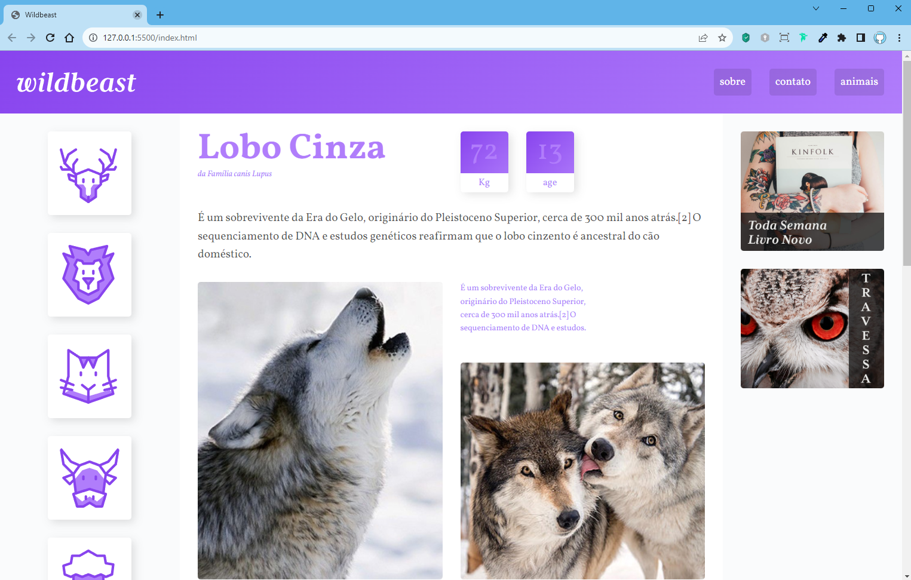
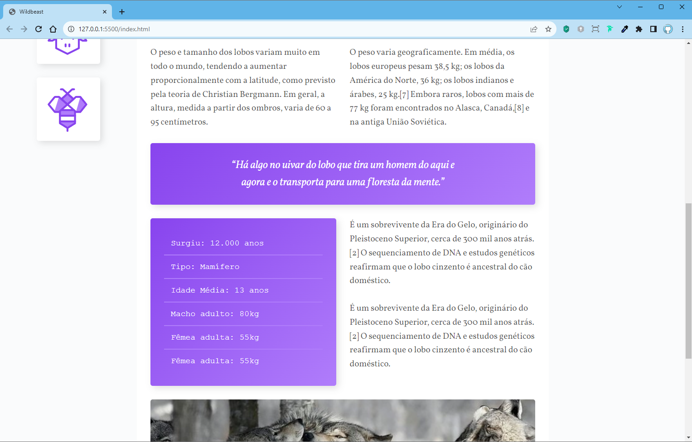
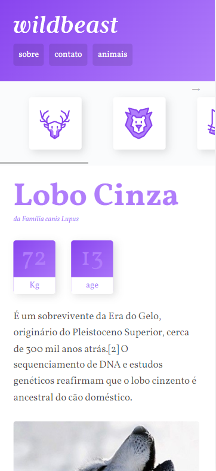
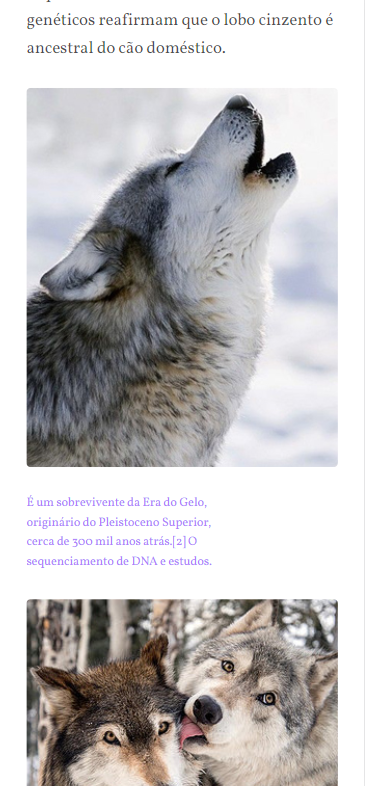
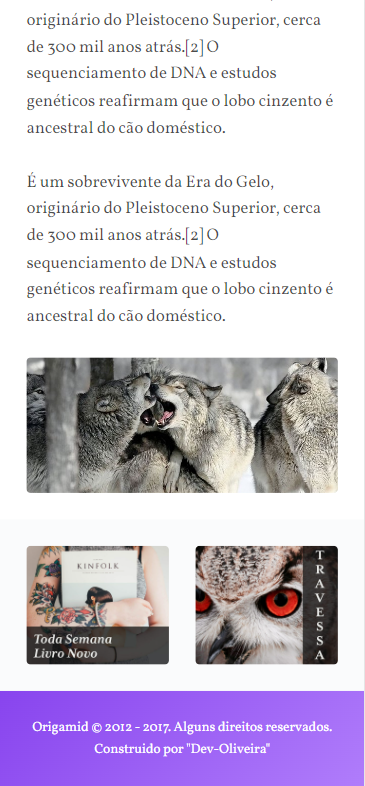

 
 

[Descrição](#--descrição-do-projeto-) |
[Funcionalidades](#%EF%B8%8F-funcionalidades) |
[Imagens](#-imagens-do-projeto-verão-web) |
[Tecnologias](#tecnologias-utilizadas-) |
[Como executar esse projeto ?](#%EF%B8%8F-como-executar-esse-projeto-) |
[Referências](#-referências-) |
[Autor](#-autor-) |

<h1 text-align="center"> 🌟WildBeast🌟</h1> 

 
 

<h2>✅ Descrição do Projeto:</h2> 

 
 

   Esse projeto faz parte do Curso de CSS Grid-Layout. da origamid Nele Desenvolvemos o Site <strong>WildBeast</strong>, onde foi aplicado técnicas de CSS Grid-layout, trabalhando com todas as propreidades do <strong>Grid-layout</strong>:
   

 
 

<h2> 📽️Video de Demostração do Projeto.</h2>

 
 

    <h2>⚙️ Funcionalidades</h2>

Nesse Projeto foi abordado as seguintes prorpiedades de <strong>grid-container:</strong>

    
    
🟨 display-grid 
🟨 grid-template-columns 
🟨 grid-template Rows 
🟨 grid-template Areas 
🟨 grid-template Rows 
🟨 grid-template  
🟨 grid-auto-columns 
🟨 grid-auto-rows 
🟨 grid-auto-flow 
🟨 grid 
🟨 justify-content 
🟨 align-content 
🟨 justify-items 
🟨 Align-itens 
  
  

Também vimos as propriedades de <strong>grid-layout-item:</strong>

    
    
🟥 Grid column 
🟥 Grid Rows 
🟥 Grid Area 
🟥 Grid Self 
🟥 Align Self 
  
  
 

 <h2>📸 Imagens do Projeto versão Web.</h2>
 

 
 

> :bulb: **Dica:** Algumas imagens da versão Desktop.

 
 

 
  

 <h2>📱 Imagens do Projeto verão Mobile.</h2>
 
 

 > :bulb: **Dica:** Algumas imagens da versão Mobile.

 
 
 
 
 

<h2>🪛Tecnologias Utilizadas </h2>

  
  

|  |  | 
|:---:|:---:|
|HTML5|CSS3|

 
 

 <h2>🛣️ Como Executar esse projeto ?</h2>

 
 
Para ter Acesso ao Projeto; clique no link Abaixo:
  

> [WildBeast]()

 
 

<h2> 📚Referências </h2>

 
 

> :memo: **Acesse:** [Origamid](https://origamid.com)

 
 

 <h2>👨🏻‍🦱 Autor </h2>
<h3> <a href="https://oliveira-portifolio.vercel.app/">Dev-Oliveira</a> </h3>
   
  
    
   
&copy; Todos os Direitos Reservados

<h1> 😁Obrigado por chegar até aqui!</h1>

